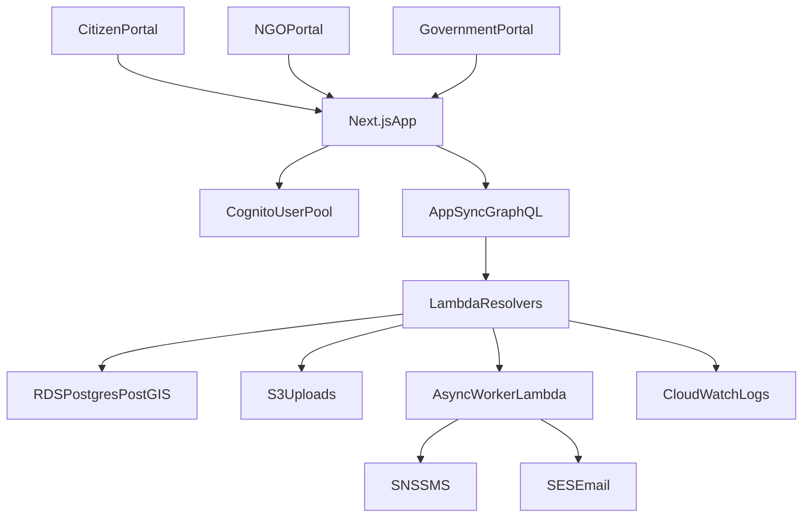

# CrisisConnect Edge

Gemma 4-powered local-first disaster management and community resilience platform for citizens, NGOs, field workers, and government agencies.

## Problem Statement

Disaster response is often fragmented across disconnected hotlines, spreadsheets, messaging groups, and static dashboards. That fragmentation causes delayed evacuations, duplicated resource allocation, and slow SOS escalation. Sri Lanka's exposure to floods, landslides, droughts, and tsunami-related risks makes those gaps especially costly.

CrisisConnect addresses that gap with a single platform that:

- registers and manages disasters in real time
- routes citizens to safe zones based on live capacity
- lets NGOs publish and fulfill resource inventory
- connects SOS requests to nearby responders
- broadcasts geofenced multi-channel alerts
- supports offline-safe workflows for critical emergency actions

## Three Portals

### Citizen portal

- live disaster map with safe zones and resources
- browse and request essentials
- submit one-tap SOS with geolocation
- read live public updates and advisories

### NGO / field worker portal

- self-register and onboard response teams
- manage inventory and field resources
- monitor and accept SOS incidents
- publish field updates to the public feed

### Government portal

- register disaster polygons and severity
- manage safe zones and occupancy
- approve organization registrations
- send SMS, email, and push-aligned alerts
- monitor finance, resources, and operational analytics

## Key Innovation Features

- **Hybrid Gemini & Gemma 4 AI Intelligence**: Powerful cloud-based Gemini orchestrates robust structured SOS preparation, multilingual safety guidance, command briefs, and dispatch recommendations. When the network is down, the system seamlessly falls back to local Gemma 4, ensuring high availability and unbroken crisis response.
- **Geofenced alerts**: disaster polygons in PostGIS drive targeted notifications.
- **Capacity-aware safe-zone routing**: citizens are routed to the nearest shelter with remaining capacity.
- **Intelligent SOS triage**: nearest available responders are identified using geospatial proximity.
- **Offline-ready experience**: service worker caches core emergency assets and keeps the app usable in degraded connectivity.
- **Infrastructure as code**: the AWS backend is fully provisioned with Terraform for repeatable setup and teardown.

## Tech Stack

- **Frontend**: Next.js App Router, TypeScript, Tailwind CSS
- **Cloud**: AWS Cognito, AppSync, Lambda, RDS PostgreSQL, SNS, SES, S3, CloudWatch
- **Infrastructure**: Terraform
- **Maps**: MapLibre + OpenStreetMap
- **Charts**: Recharts
- **Database extensions**: PostGIS
- **AI runtime**: Gemini (Primary Cloud Provider) with Gemma 4 via local Ollama / reachable edge gateway as a resilient offline fallback

## Architecture Overview



## Project Structure

```text
infrastructure/    Terraform for AWS resources
db/                SQL schema and demo seed
lambda/            AppSync resolver and async worker code
src/               Next.js frontend portals and shared UI
public/            PWA manifest and service worker
docs/              Demo and presentation material
```

## Local Setup

### 1. Install dependencies

```bash
npm install --legacy-peer-deps
```

### 2. Configure frontend environment

Copy `.env.example` to `.env.local` and fill in the Terraform outputs after provisioning AWS.

For local Gemma 4 development, keep `AI_PROVIDER=gemma`, `GEMMA_RUNTIME=ollama`, and set `GEMMA_ENDPOINT=http://localhost:11434`. For deployed AWS Lambda, `GEMMA_ENDPOINT` must point to a reachable Gemma gateway or hosted endpoint; Lambda `localhost` is the Lambda sandbox, not your development machine.

The citizen web offline advisor also calls a local Gemma endpoint from the browser. Set `NEXT_PUBLIC_GEMMA_ENDPOINT=http://localhost:11434` and `NEXT_PUBLIC_GEMMA_MODEL=gemma4:e4b` for the Module E demo; if Ollama is unavailable, the page falls back to deterministic cached-data guidance.

Emergency sync packages can include offline map tile manifests for bounded disaster areas. The default local/demo template is `https://tile.openstreetmap.org/{z}/{x}/{y}.png`; production deployments should use an owned, cached, or otherwise approved tile service instead of bulk-downloading public OSM tiles.

### 3. Provision infrastructure

```bash
cd infrastructure
copy terraform.tfvars.example terraform.tfvars
terraform init
terraform plan -var="db_password=YourStrongPassword123!" -var="ses_sender_email=alerts@example.com"
terraform apply
```

### 4. Database bootstrap

`terraform apply` now runs the database bootstrap automatically after RDS becomes reachable.

It executes:

- `db/migrations/001_schema.sql`
- `db/migrations/002_gemma_offline_intelligence.sql`
- `db/seed.sql`

through `scripts/bootstrap-db.mjs`.

Manual fallback is still available:

```bash
node scripts/run-sql.mjs db/migrations/001_schema.sql
node scripts/run-sql.mjs db/migrations/002_gemma_offline_intelligence.sql
node scripts/run-sql.mjs db/seed.sql
```

### 5. Run the app

```bash
npm run dev
```

Open:

- `http://localhost:3000/`
- `http://localhost:3000/citizen/dashboard`
- `http://localhost:3000/ngo/dashboard`
- `http://localhost:3000/admin/dashboard`

## Validation Performed

- `npm run build`
- `npm run typecheck`
- `terraform -chdir=infrastructure validate`
- `terraform -chdir=infrastructure plan -input=false -lock=false -var="db_password=HackathonTemp123!" -var="ses_sender_email=alerts@example.com" -var="app_url=http://localhost:3000"`

The Terraform plan currently resolves to **61 resources to add**.

## Demo Flow

Use this sequence in the live presentation:

1. Government creates a new Colombo flood disaster polygon.
2. Alert composer sends a geofenced warning.
3. Citizen portal shows the updated map and a nearby safe zone.
4. Citizen submits an SOS request.
5. NGO portal receives the SOS in the live queue and accepts dispatch.
6. Government dashboard shows analytics and resource/finance visibility.

Detailed presentation material is included in:

- `docs/demo-script.md`
- `docs/presentation-outline.md`

## Notes

- The frontend runs in demo mode if AWS environment variables are missing, so judges can still navigate the full UX.
- The middleware enforces role-based route protection when Cognito is configured.
- The Terraform stack is optimized for a hackathon deployment path and easy teardown.
